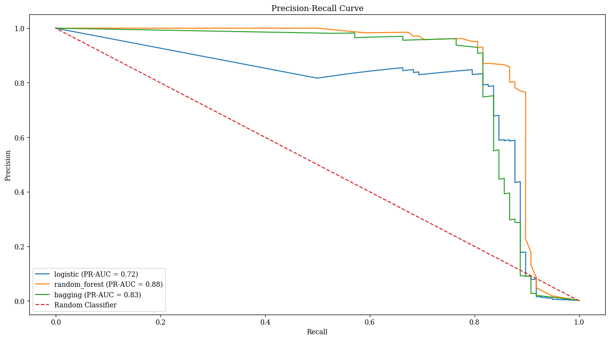

# Credit Card Fraud Detection

The primary goal of this project is to design and implement machine learning models to detect fraudulent transactions in credit card data. The dataset used in this notebook is the [Credit Card Fraud Detection]((https://www.kaggle.com/datasets/mlg-ulb/creditcardfraud)) from Kaggle, made by credit cards in September 2013 by European cardholders. The dataset presents transactions that occurred in two days, where we have 492 frauds out of 284,807 transactions. The dataset is highly unbalanced, the positive class (frauds) account for 0.172% of all transactions. The dataset was preprocessed to address issues such as missing values, normalization, and class imbalance using Synthetic Minority Over-Sampling Technique (SMOTE). 

We implemented and compared multiple machine learning algorithms, including Random Forest, Bagging, and Logistic Regression.

The evaluation of these models was based on metrics such as accuracy, precision, recall, F1-Score, ROC-AUC, and PR-AUC. The Random Forest classifier emerged as the best-performing model, achieving a precision of 100.0%, recall of 85.0%, F1-Score of 85.9%, ROC-AUC of 97.0%, and PR-AUC of 87.9%. Bagging and Logistic Regression models also demonstrated notable performances, with Bagging achieving a precision of 99.8% and Logistic Regression a recall of 97.4%.

| Model           | Acc Train | Acc Test | Precision | Recall | F1   | ROC-AUC | PR-AUC |
|-----------------|-----------|----------|-----------|--------|------|---------|--------|
| random_forest   | 100.0     | 100.0    | 85.0      | 86.7   | 85.9 | 97.0    | 87.9   |
| bagging         | 100.0     | 99.8     | 45.4      | 84.7   | 59.1 | 95.5    | 83.3   |
| logistic        | 95.2      | 97.4     | 5.8       | 91.8   | 10.9 | 97.0    | 72.4   |

